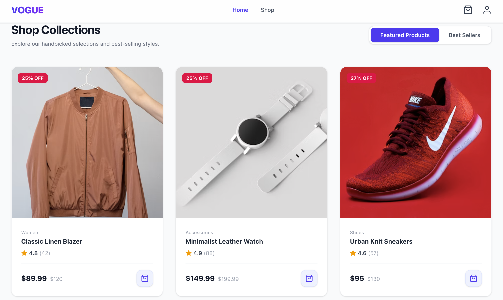

<p align="center">
  
</p>

# VOGUE - Premium E-Commerce Fashion Store

[](https://react.dev/)
[](https://tailwindcss.com/)
[](https://www.netlify.com/)
[](https://opensource.org/licenses/MIT)

A modern, responsive, and performance-optimized single-page e-commerce landing application built from scratch. This project is a frontend-only application showcasing top-tier UI/UX aesthetics, modular component architecture, and clean code principles.

---

## 🚀 Live Demo & Repository

- **GitHub Repository:** [https://github.com/ranak8811/CodesRaft-Frontend-Developer.git](https://github.com/ranak8811/CodesRaft-Frontend-Developer.git)
- **Live Deployment Link:** [Netlify deployed Link](https://codesraft-frontend.netlify.app)

---

## ✨ Core Features

### 1. Modern Responsive Landing Page

- **Glassmorphism Navigation Bar:** A sticky header that features real-time shopping bag counter badges and transitions dynamically between desktop and mobile viewport sizes.
- **Auto-Zooming Hero Section:** A beautiful banner using slow-zooming background frames overlaid with bold typography and clear Call-to-Action guides.
- **Tabbed Collection Filtering:** Seamlessly toggles product card grids between _Featured Products_ and _Best Sellers_ without page reloads.
- **Deal of the Week Countdown:** Displays a live, real-time hours/minutes/seconds countdown clock highlighting a special discounted product.
- **Value Propositions & Reviews:** Spotlights customer trust markers (Free Shipping, Secure Checkout, etc.) alongside a dynamic 5-star review carousel.
- **Newsletter Subscription:** Custom-designed dark gradient newsletter input section with instant browser-validation prompts.

### 2. Interactive Product Details Page

- **URL Parameter Matching:** Dynamically fetches and renders individual product files using the `react-router-dom` params (`/product/:id`).
- **Interactive Image Gallery:** Allows viewers to toggle the main highlight banner image by clicking through thumbnail collections.
- **Spec Sheet & Purchase Tools:** Renders rating metrics, pricing comparison sheets (original vs. sale), feature bullet points, and an interactive quantity selector.
- **Category Related Products:** Computes and showcases similar style cards in a grid layout footer.
- **Hook Resets:** Leverages React effects to clean up image selectors and quantities when navigating between related products.

### 3. State-driven Shopping Cart Page

- **Dynamic Cart Interactions:** Users can add new items, modify purchase quantities (+ / -), and delete elements.
- **Computed Subtotals:** Computes subtotal values and automatically applies a shipping fee threshold ($150 minimum order for free shipping).
- **Persistence Layer:** Saves active checkout items directly inside browser `LocalStorage` so session data is preserved after reloads.
- **Polished Empty States:** Displays custom shopping prompts if the bag count is zero.

### 4. Fully Validated Checkout Flow

- **Detailed Form Inputs:** Captures customer names, emails, phones, and addresses.
- **Conditional Payment Panels:** Radios dynamically toggle credit card details or support screens for PayPal and Cash on Delivery.
- **Rigorous Form Validations:** Inspects inputs for empty fields, email structures, 16-digit card limits, MM/YY expires, and CVV checks.
- **Success Pop-up Overlay:** Shows a confirmation modal presenting order details and dynamic Order IDs on order placement.

---

## ⚙️ Installation & Local Setup

To run this project locally, follow these steps:

1. **Clone the repository:**

   ```bash
   git clone https://github.com/ranak8811/CodesRaft-Frontend-Developer.git
   ```

2. **Navigate to the project root:**

   ```bash
   cd CodesRaft-Frontend-Developer
   ```

3. **Install the dependencies:**

   ```bash
   npm install
   ```

4. **Start the development server:**

   ```bash
   npm run dev
   ```

5. Open your browser and visit `http://localhost:5173`.

---

## 📁 Folder Directory

```text
src/
├── assets/         # Project images, logo vectors, and mock icons
├── components/     # Reusable layout sections (Navbar, Footer, Hero, Newsletter etc.)
├── context/        # Shopping Cart Context API provider
├── data/           # Mock database representation (categories, products, reviews)
├── hooks/          # Custom React hooks (useCart, useScrollToTop)
├── pages/          # Full page views (Home, ProductDetails, Cart, Checkout)
├── App.jsx         # App router and global provider packaging
├── index.css       # Core Tailwind imports and global animations
└── main.jsx        # App entry point
```

---

## 🌎 Production Build & Netlify Routing

To compile the application into static production assets, execute:

```bash
npm run build
```

This generates a highly optimized distribution bundle in the `/dist` directory.

### ⚠️ Netlify SPA Routing Fix

To prevent **404 Page Not Found** errors when users refresh or directly visit sub-routes (such as `/cart` or `/checkout`) on Netlify, the application includes a redirects config located at `public/_redirects`:

```text
/*    /index.html    200
```

This instructs Netlify's CDN servers to rewrite all sub-path queries back to the main `index.html` file, letting the client-side router handle page transitions seamlessly.

---
